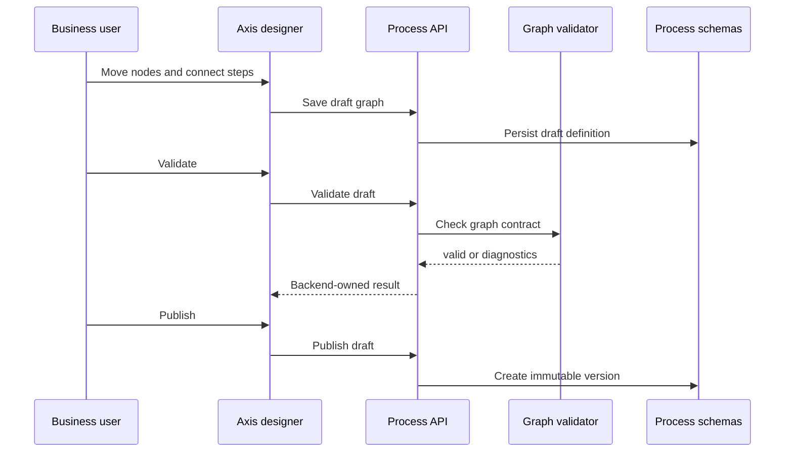

# Visual Workflow Designer Contract

The visual workflow designer lets a business user or developer edit a process
graph through Axis. The important contract is that Axis is an editor, not the
runtime authority.

## Ownership model



Axis can display nodes, edges, positions, labels, and selection state. The
backend validates whether the graph is executable.

## MVP graph contract

The first designer contract supports:

- one `START` node;
- one or more `TASK` nodes;
- one or more `END` nodes;
- transitions with stable codes, source, and target;
- optional designer metadata for browser positions.

```json
{
  "nodes": [
    { "code": "start", "type": "START", "name": "Start" },
    { "code": "businessReview", "type": "TASK", "name": "Business review" },
    { "code": "end", "type": "END", "name": "End" }
  ],
  "transitions": [
    { "code": "start_to_review", "source": "start", "target": "businessReview" },
    { "code": "review_to_end", "source": "businessReview", "target": "end" }
  ]
}
```

## What the browser may do

Axis may:

- render a node palette;
- show a canvas preview;
- let the user select nodes;
- collect labels and basic properties;
- send draft graph data to Process APIs;
- show backend validation diagnostics.

Axis must not:

- execute process logic;
- calculate runtime state;
- bypass backend validation;
- store workflow definitions in browser storage as authority;
- create a parallel workflow registry.

## Designer acceptance

The designer foundation is healthy when:

1. A user can see START, TASK, and END nodes.
2. A user can inspect selected node details.
3. Saving calls the Process draft API.
4. Validation calls the Process graph validator.
5. Publishing remains a separate backend-owned action.
6. The same graph can be verified through API tests and fresh acceptance.

## Continue

- [Developer Customization Guide](developer-customization.md)
- [Runtime Instance and Task Lifecycle](runtime-lifecycle.md)
