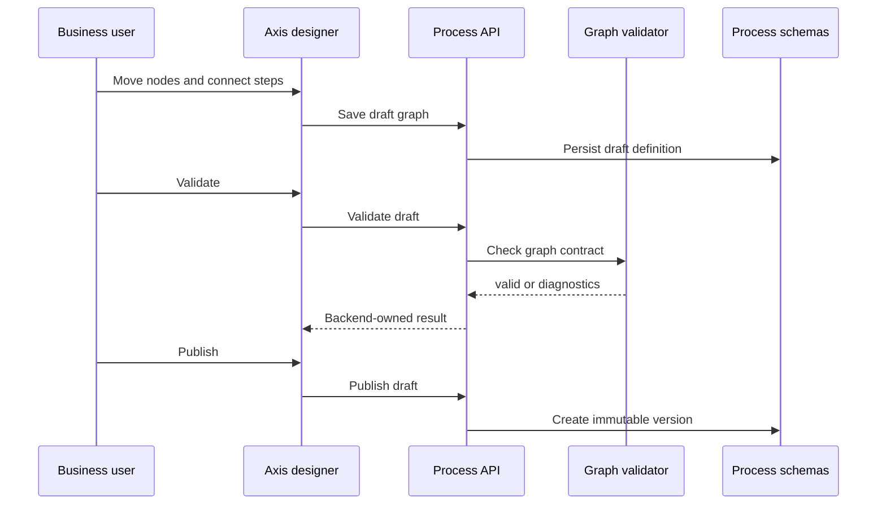
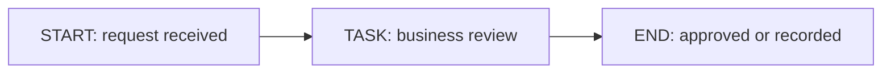

# Visual Workflow Designer Contract

The visual workflow designer lets a business user or developer edit a process
graph through Axis. The important contract is that Axis is an editor, not the
runtime authority.

## Ownership model



Axis can display nodes, edges, positions, labels, and selection state. The
backend validates whether the graph is executable.

## MVP graph contract

The first designer contract supports:

- one `START` node;
- one or more `TASK` nodes;
- one or more `END` nodes;
- transitions with stable codes, source, and target;
- optional designer metadata for browser positions.

```json
{
  "nodes": [
    { "code": "start", "type": "START", "name": "Start" },
    { "code": "businessReview", "type": "TASK", "name": "Business review" },
    { "code": "end", "type": "END", "name": "End" }
  ],
  "transitions": [
    { "code": "start_to_review", "source": "start", "target": "businessReview" },
    { "code": "review_to_end", "source": "businessReview", "target": "end" }
  ]
}
```

## What the browser may do

Axis may:

- render a node palette;
- show a canvas preview;
- let the user select nodes;
- collect labels and basic properties;
- send draft graph data to Process APIs;
- show backend validation diagnostics.

Axis must not:

- execute process logic;
- calculate runtime state;
- bypass backend validation;
- store workflow definitions in browser storage as authority;
- create a parallel workflow registry.

## How a beginner should use the first designer

The first designer is intentionally simple. It is not trying to be a complex
diagramming tool on day one. It gives a business user a safe way to understand
the shape of a workflow and gives a developer a safe way to prove the backend
graph contract.

Start with this flow:



Then ask these business questions before adding more nodes:

| Question | Why it matters | Where the answer belongs |
| --- | --- | --- |
| Who starts this process? | Prevents hidden automation and duplicate cases. | Process trigger metadata or domain API call. |
| Who owns the human task? | Makes the work queue visible. | Process task assignment policy. |
| What happens if the task is delayed? | Defines SLA and escalation. | Process policy, future timer, or Cron relationship. |
| What business object is affected? | Lets users connect workflow to real work. | Process instance context and domain module reference. |
| What evidence is required? | Supports audit and compliance. | Process audit event and domain audit. |

If a user cannot answer these questions, the flow is not ready for publication
even if the graph is technically valid.

## Designer library roadmap

The first implementation uses a Nodics-native card/canvas projection because it
keeps the contract easy to test. The roadmap is:

1. keep the backend graph contract stable;
2. keep Axis as the renderer/editor only;
3. add drag/drop layout metadata after the save/validate/publish flow is stable;
4. evaluate React Flow / xyflow as the first richer canvas implementation;
5. add BPMN import/export only as an interoperability adapter when a customer
   needs it.

This sequence prevents a drawing library from becoming the workflow authority.
The designer may become more attractive and interactive, but the validation,
versioning, permissions, runtime execution, and audit evidence must remain in
`nodics.process`.

## Designer acceptance

The designer foundation is healthy when:

1. A user can see START, TASK, and END nodes.
2. A user can inspect selected node details.
3. Saving calls the Process draft API.
4. Validation calls the Process graph validator.
5. Publishing remains a separate backend-owned action.
6. The same graph can be verified through API tests and fresh acceptance.
7. Axis refresh is not required after create, save, validate, publish, trigger,
   task, or Cron handoff operations.
8. A business user can explain the workflow outcome from the page without
   reading raw JSON.
9. A developer can reproduce the same graph through the Process API.
10. An operator can trace a started instance from trigger/job evidence through
    Process audit events.

## Continue

- [Developer Customization Guide](developer-customization.md)
- [Runtime Instance and Task Lifecycle](runtime-lifecycle.md)
