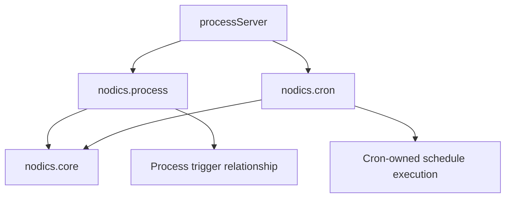

# Process Ownership and Visual Designer Contract

This contract protects the Process direction while the framework is still
modularising. It is written for human developers and AI tools before they touch
Process, Cron, Axis, or customer overlay code.

## Roles

| Role | Responsibility |
| --- | --- |
| `nodics.process` | Owns process definitions, versions, runtime instances, tasks, audit events, trigger relationships, graph validation, and workflow publication governance. |
| `nodics.cron` | Owns cron job definitions, cron runtime state, schedule firing, retries, job history, and scheduler health. |
| Domain modules | Own domain actions and side effects such as order cancellation, media processing, customer onboarding, fulfilment, payment, notification, and compensation logic. |
| `nodics.axis` | Renders authorized backend contracts. It may edit drafts through APIs, but it must not become a workflow registry, scheduler, or runtime engine. |
| Customer modules | Extend or override standard Process behavior by layering services, validators, adapters, properties, and data packs without editing standard framework source. |

## Process plus Cron topology

Process and Cron may share a runtime server to reduce operational overhead:

The shared server is only deployment composition. Ownership remains separate:

- Process stores the relationship saying a process can be started by a
  schedule.
- Cron stores and executes the actual schedule.
- A governed integration calls Process APIs when a Cron job fires.
- Axis shows the relationship in one console so business users do not need to
  understand the internal server graph.

## Visual designer direction

The first designer should be easy for business users and safe for developers:

1. Axis shows a canvas projection of the draft graph.
2. Users add and connect supported node types.
3. Axis sends the graph draft to Process APIs.
4. Process validates the graph and returns issues.
5. Only a valid draft can be published into an immutable version.

Axis must not execute the graph locally and must not persist designer data
directly. Layout metadata can be captured as draft presentation metadata, but
the executable workflow definition is always backend-owned.

The first Axis designer can be a simple card/canvas editor. Rich drag/drop
libraries are optional presentation upgrades, not architecture foundations. A
library such as React Flow / xyflow may be adopted after the save, validate,
publish, and runtime evidence contracts are stable. BPMN interoperability
should be an adapter layer, not the default authority for Nodics workflow
semantics.

## Where code belongs

| Change | Correct location |
| --- | --- |
| Process graph validation | `modules/workflow/modules/flowCore/src/service/designer` |
| Definition draft/version lifecycle | `modules/workflow/modules/flowCore/src/service/definition` |
| Runtime instance/task lifecycle | `modules/workflow/modules/flowCore/src/service/operation` |
| Process API route/controller/facade | `modules/workflow/modules/flowApi/src` |
| Process schemas/status/error definitions | `modules/workflow/modules/flowSchema/src` |
| Axis process UI | `nodics.axis/src/operations/processWorkflow` |
| Cron job runtime | `nodics.cron` |
| Domain business action | The owning domain module, never `nodics.process` by default |
| Customer override | Customer module that extends the framework module |

## Acceptance rules

- Process routes must be secured and mapped to explicit permissions.
- Trigger lifecycle must validate status, missing definitions, missing triggers,
  and archived-trigger mutation attempts.
- Axis designer must let a user change draft graph JSON only through Process
  APIs, then refresh local state without requiring a browser page reload.
- Cron controls shown inside the Process and Automation experience must call
  Cron-owned routes and must remain subject to `cronjob.lifecycle.manage`.
- Documentation for Process must be backend-owned by `nodics.process` and
  imported through WCMS content packs.
- Fresh bootstrap acceptance must verify Process APIs, Axis Process routes,
  Process documentation import, Process/Cron observed module composition,
  Cron-to-Process trigger handoff, OpenAPI module metadata, and registry
  lifecycle.
