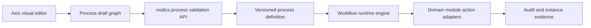

# Visual Workflow Designer Decision

Axis should support visual process design, but the designer must remain a
projection over backend-owned `nodics.process` definitions.

## Decision

Use a Nodics-native graph model first and evaluate React Flow / xyflow as the
initial browser rendering library. Add BPMN import/export later only if
customers need BPMN 2.0 interoperability. Do not adopt a commercial designer
toolkit until licensing, offline build, customization, accessibility, and
enterprise support constraints are approved.

## Evaluation

| Option | Fit | Why |
| --- | --- | --- |
| React Flow / xyflow | Best first fit | It is React-native, customizable, and MIT-licensed according to official project material. It fits a Nodics-specific node/transition editor where backend JSON definitions remain authoritative. |
| BPMN.io / bpmn-js | Good interoperability adapter | It is strong when BPMN 2.0 XML compatibility is required. Its official toolkit supports browser modeling, but a pure BPMN surface may force Nodics concepts into BPMN vocabulary too early. |
| JointJS / JointJS+ | Defer | The open-source core uses MPL-2.0 and advanced tooling may involve JointJS+ commercial licensing. Evaluate only after the native designer proves insufficient. |

Official references checked on 2026-08-09:

- React Flow / xyflow: <https://reactflow.dev/>
- BPMN.io license and bpmn-js toolkit: <https://bpmn.io/license/> and <https://bpmn.io/toolkit/bpmn-js/>
- JointJS licensing: <https://www.jointjs.com/license>

## Architecture rule

The browser may draw nodes, capture positions, show validation messages, and
help users compose transitions. It must not execute workflow actions, persist
definitions directly to MongoDB, decide permissions, or treat graph state as
published runtime truth.
