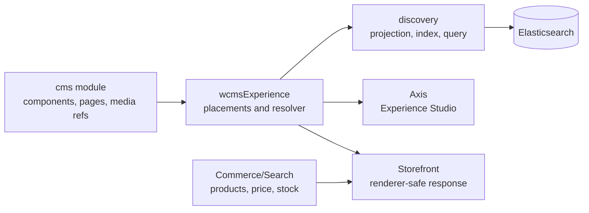
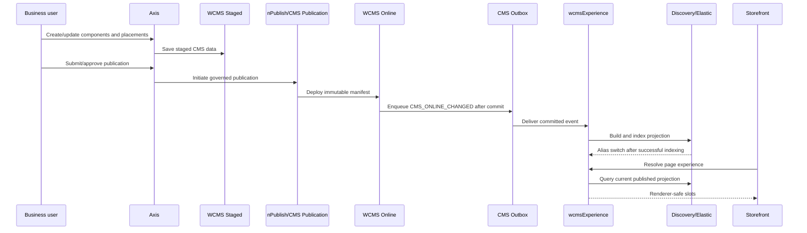

# WCMS Experience Developer Implementation Contract

Status: Frozen for implementation.

This contract explains how developers extend or integrate `wcmsExperience` without breaking Nodics ownership, publication, search, or storefront-delivery principles.

## 1. Capability purpose

`wcmsExperience` resolves targeted, published CMS page experiences for a storefront or content site.

It answers one question:

```text
For this site, page type, slot, target, locale, channel, device, and customer context,
which published CMS component or container should be rendered?
```

It does not own product search, cart, checkout, inventory, pricing, or customer journey business logic.

## 2. Module location and dependency direction

Module location:

```text
nodics.ai/nodics.wcms/modules/wcmsExperience
```

Dependency direction:



Rules:

- `wcmsExperience` may depend on CMS, Media, WCMS, Search, Elastic, and generic Discovery modules.
- `wcmsExperience` must not depend on Commerce-specific discovery or Agora-specific code.
- Customer/reference data belongs in project modules such as `agora.apparel`.
- Generic reusable logic belongs in the framework module.

## 3. Source of truth

| Concern | Owner | Reason |
| --- | --- | --- |
| Component content | CMS | Business-authored renderable content |
| Component composition/container children | CMS component detail | Reuses existing component graph |
| Targeting/placement | `cmsExperiencePlacement` | Decides where and when components appear |
| Delivery projection | Discovery/Elasticsearch | Fast bounded runtime lookup |
| Product result set | Commerce/Search | Product data, prices, variants, inventory |
| Rendering | Storefront | Uses renderer key and version only |
| Authoring/preview/status UI | Axis | Business control surface |

## 4. Lifecycle contract



Forbidden paths:

- draft save directly updates Online delivery;
- storefront request-time rendering indexes content;
- Agora reads mutable CMS Staged records;
- Axis bypasses publication/approval to expose public content.

## 5. `cmsExperiencePlacement` model contract

Required fields:

```text
code
site
pageType
slot
targetType
targetCode
component
```

Important optional fields:

```text
rendererKey
contractVersion
properties
media
specificity
priority
locale
channel
region
device
customerSegments
validFrom
validTo
fallbackComponent
publicationStatus
deliveryStatus
release
indexVersion
revision
```

The schema must stay wrapped under the module key:

```js
module.exports = {
  wcmsExperience: {
    cmsExperiencePlacement: {
      // schema definition
    }
  }
};
```

## 6. Resolver contract

Input:

```json
{
  "site": "agoraApparelSite",
  "pageType": "PRODUCT_LISTING",
  "targetType": "COLLECTION",
  "targetCode": "agoraNewArrivals",
  "locale": "en-US",
  "channel": "web",
  "device": "desktop"
}
```

Output:

```json
{
  "site": "agoraApparelSite",
  "pageType": "PRODUCT_LISTING",
  "release": "agora.apparel:agoraApparelContentCatalog:0.0.2",
  "indexVersion": "manifest-v12",
  "slots": {
    "hero": [
      {
        "placementCode": "agoraApparelShopNewArrivalsHeroPlacement",
        "componentCode": "agoraApparelProductListingExperience",
        "rendererKey": "agora.productListing",
        "contractVersion": 1,
        "properties": {
          "heading": "Fresh styles just in"
        },
        "media": []
      }
    ]
  },
  "diagnostics": {
    "matched": true,
    "fallbackUsed": false,
    "placementCount": 1
  }
}
```

Public payload rules:

- include only storefront-safe values;
- do not expose raw rules, score internals, storage ids, or draft metadata;
- do not include executable scripts, implementation bundle URLs, or frontend component imports.

## 7. Slot fallback behavior

Targeted matches override only matching slots.

```text
Default /shop placements:
  hero -> default shop hero
  featuredCarousel -> default projected products

/shop?collection=agoraNewArrivals placements:
  hero -> new arrivals hero

Resolved result:
  hero -> new arrivals hero
  featuredCarousel -> default projected products
```

## 8. Indexing contract

Indexing is handled by:

```text
DefaultWcmsExperiencePublicationIndexingService
```

It consumes committed `CMS_ONLINE_CHANGED` outbox events and builds generic Discovery documents:

```text
ownerType: WCMS_EXPERIENCE
indexConfigurationCode: cmsExperiencePlacement
payload: delivery-safe placement projection
```

Idempotent document identity:

```text
wcmsExperience|site|pageType|slot|targetType|targetCode|locale|channel|indexVersion
```

Alias switching happens only after all documents save successfully.

If indexing fails, the CMS outbox event must remain replayable.

## 9. Preview and Online split

| Mode | Caller | Projection status | Required behavior |
| --- | --- | --- | --- |
| Public delivery | Storefront | `ONLINE` / `CURRENT` | Controller forces `previewMode=false` |
| Axis preview | Axis | `STAGED` | Controller forces `previewMode=true` |

Public APIs must never accept caller-controlled preview mode.

## 10. Performance guardrails

Resolver lookup must be bounded by tenant, site, page type, target type/code, locale, channel, device, and date.

The resolver must pass an explicit bounded search option to Discovery:

```text
searchOptions.pageSize = wcmsExperience.resolver.maxComponents
```

For storefront product listing journeys, product search pagination remains separate and should use the page contract agreed for Agora Apparel, for example `page=1&pageSize=10`.

Resolver must not:

- must not scan all CMS components;
- evaluate arbitrary scripts;
- traverse full page trees at request time;
- fetch products, prices, variants, or inventory.

## 11. Extension checklist

When adding a new page type or target type:

1. Add or reuse stable enum values.
2. Add CMS components/containers in the customer/project module.
3. Add `cmsExperiencePlacement` data in the customer/project module.
4. Add import header entries.
5. Update data manifest hashes.
6. Add a contract test proving the placement resolves.
7. Add renderer contract/version support in the storefront.
8. Validate Axis preview and public delivery separately.
