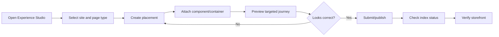

# Axis Experience Studio Guide

Experience Studio is the business and developer control surface for targeted CMS experiences.

It can later be integrated with Page Designer, but it must keep the same backend model:

```text
CMS component/container + cmsExperiencePlacement + publish/index status
```

## 1. Navigation

Recommended Axis navigation:

```text
Content and Experience
  Experience Studio
    Placements
    Preview
    Index Status
```

Required permissions:

| Axis section | Permission |
| --- | --- |
| Experience Studio | `WCMS_EXPERIENCE_VIEW` |
| Placements | `WCMS_EXPERIENCE_VIEW`, `WCMS_EXPERIENCE_EDIT` |
| Preview | `WCMS_EXPERIENCE_PREVIEW` |
| Index Status | `WCMS_EXPERIENCE_PUBLISH_STATUS` |
| Override/Rollback actions | `WCMS_EXPERIENCE_OVERRIDE` |

## 2. Placements screen

Purpose:

```text
Let business users decide where and when CMS components appear.
```

Recommended list columns:

| Column | Example |
| --- | --- |
| Code | `agoraApparelShopNewArrivalsHeroPlacement` |
| Site | `agoraApparelSite` |
| Page type | `PRODUCT_LISTING` |
| Slot | `hero` |
| Target type | `COLLECTION` |
| Target code | `agoraNewArrivals` |
| Component | `agoraApparelProductListingExperience` |
| Priority | `90` |
| Status | `ACTIVE` |
| Publication | `STAGED` |
| Locale | `en-US` |
| Channel | `web` |

Recommended filters:

- site;
- page type;
- slot;
- target type;
- target code;
- status;
- locale;
- channel;
- date window.

## 3. Placement editor

Recommended sections:

```text
Identity
  Code
  Name/description if available

Scope
  Site
  Page type
  Slot
  Locale
  Channel
  Region
  Device

Targeting
  Target type
  Target code
  Customer segments
  Priority
  Specificity
  Date window

Content
  Component/container selector
  Renderer key preview
  Contract version
  Media preview
  Property preview

Governance
  Delivery status
  Publication status
  Revision
```

## 4. Visual layout suggestion

Wireframe:

```text
┌──────────────────────────────────────────────────────────────┐
│ Experience Studio                                             │
│ Configure targeted CMS experiences for published journeys.    │
├───────────────────────┬──────────────────────────────────────┤
│ Filters               │ Placements                            │
│ Site                  │ ┌──────────────────────────────────┐ │
│ Page type             │ │ New Arrivals Hero                │ │
│ Target type           │ │ PRODUCT_LISTING / hero           │ │
│ Status                │ │ COLLECTION: agoraNewArrivals     │ │
│                       │ │ Component: ProductListingExp.    │ │
│                       │ └──────────────────────────────────┘ │
└───────────────────────┴──────────────────────────────────────┘
```

## 5. Preview screen

Purpose:

```text
Resolve a Staged experience before publishing.
```

Preview form fields:

```text
Site
Page type
Target type
Target code
Locale
Channel
Device
Region
Customer segment
Preview date/time
```

The preview API must force:

```text
previewMode=true
```

Recommended preview result panels:

1. Resolved slots.
2. Matched placements.
3. Fallback slots used.
4. Renderer key and contract version.
5. Missing/unsupported renderers.
6. Scheduling conflicts.
7. Storefront-safe JSON payload.

## 6. Index Status screen

Purpose:

```text
Let business and support users verify whether published experiences are indexed and active.
```

Recommended status cards:

```text
Current Online index
  Alias: cms_experience_agoraApparelSite_online_current
  Version: manifest-v12
  Documents: 42
  Last indexed: 2026-08-31 10:15
  Status: Current

Staged preview index
  Alias: cms_experience_agoraApparelSite_staged_current
  Version: manifest-v13-preview
  Documents: 45
  Status: Ready for approval

Failures
  Last failed event
  Retry count
  Failure code
  Suggested recovery action
```

## 7. Page Designer integration later

Later, Page Designer may expose an action:

```text
Attach experience rule
```

But it must create/update the same backend entity:

```text
cmsExperiencePlacement
```

Do not create a second Page Designer-only rule model.

## 8. Axis user journey


