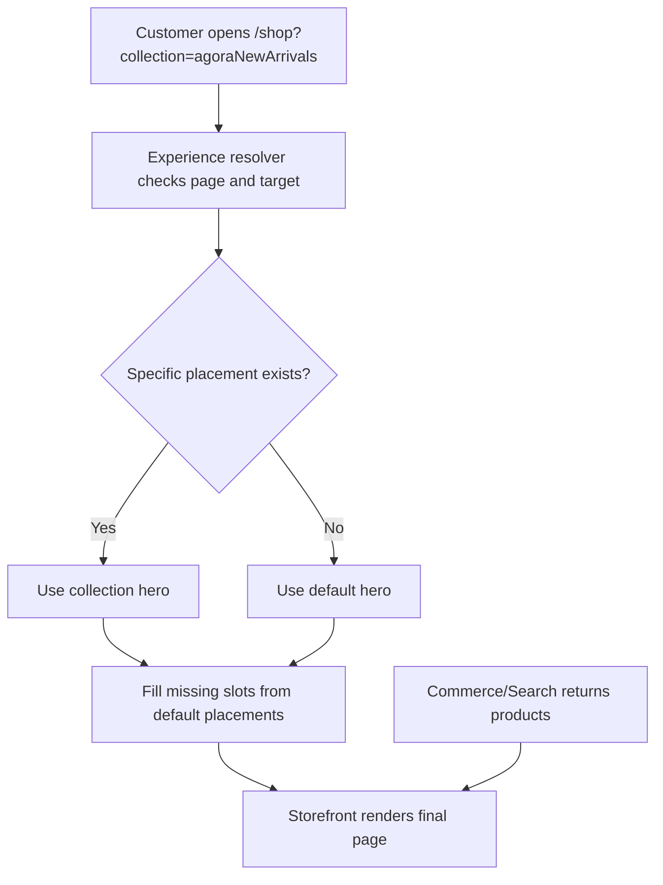

# WCMS Experience Business Configuration Guide

This guide explains how a business user configures targeted storefront experiences without frontend code changes.

The examples use Agora Apparel names, but the capability is framework-level and reusable.

Business users do not edit frontend code. They configure CMS components, placements, targeting, scheduling, preview, and publication through Axis.

## 1. What business users control

Business users control:

- page-level hero banners;
- promotional strips;
- featured product carousels;
- editorial content blocks;
- below-grid merchandising content;
- SEO content blocks;
- default/fallback experience;
- category-specific experience;
- collection-specific experience;
- brand-specific experience;
- scheduling and activation windows.

Business users do not directly control:

- product prices;
- inventory;
- checkout behavior;
- payment logic;
- cart calculations;
- search engine internals;
- frontend component code.

## 2. Business mental model

Think of a page as named slots:

```text
Product Listing Page
  hero
  topPromo
  featuredCarousel
  productGrid
  belowGrid
  seoContent
```

`wcmsExperience` controls CMS slots around the commerce product grid. Commerce/Search controls the product grid itself.



## 3. Core terms

| Term | Meaning |
| --- | --- |
| Component | Actual content block, image, text, banner, or carousel configuration |
| Container | A component that contains child components |
| Placement | Rule saying where/when a component appears |
| Slot | Page location such as `hero` or `featuredCarousel` |
| Target type | Journey being targeted: default, category, collection, brand |
| Target code | Exact category/collection/brand code |
| Priority | Which placement wins when multiple placements match |
| Fallback | Default placement used when a specific placement is missing |

## 4. Configure default shop hero

Business goal:

```text
When customers open /shop, show a general apparel hero.
```

Placement:

```text
Page type: PRODUCT_LISTING
Slot: hero
Target type: DEFAULT
Target code: *
Component: agoraApparelProductListingExperience
Priority: 10
Status: Active
```

Content:

```text
Eyebrow: Shop the edit
Heading: Apparel selected for now
Summary: Browse live apparel products with editorial merchandising.
Image: agora-owned-product-listing-wide-hero
Primary action: Shop new arrivals
Secondary action: Explore collections
```

Result:

```text
/shop -> default shop hero
```

## 5. Configure collection journey

Business goal:

```text
When customers click New in, show a new-arrivals hero but keep the rest of the shop page reusable.
```

Placement:

```text
Page type: PRODUCT_LISTING
Slot: hero
Target type: COLLECTION
Target code: agoraNewArrivals
Component: agoraApparelProductListingExperience
Priority: 90
Specificity: 100
Status: Active
```

Content:

```text
Eyebrow: New season edit
Heading: Fresh styles just in
Summary: A curated arrival story for shoppers landing from New in.
Image: agora-owned-collection-new-in
Primary action: Shop new in
Secondary action: View all collections
```

Result:

```text
/shop?collection=agoraNewArrivals
  hero -> New arrivals hero
  featuredCarousel -> default projected products
  productGrid -> products returned by Commerce/Search for agoraNewArrivals
```

## 6. Configure brand journey

Business goal:

```text
When customers land from a brand, show brand-specific editorial content.
```

Placement:

```text
Page type: PRODUCT_LISTING
Slot: hero
Target type: BRAND
Target code: atelier-minimal
Component: brandHeroContainer
Priority: 95
Specificity: 100
Status: Active
```

Content:

```text
Eyebrow: Brand focus
Heading: Atelier Minimal
Summary: Clean tailoring, soft neutral tones, and refined daily staples.
Image: brand atelier hero image
Primary action: Shop Atelier Minimal
Secondary action: View all brands
```

Result:

```text
/shop?brand=atelier-minimal
  hero -> brand-specific hero
  featuredCarousel -> brand-specific carousel if configured, otherwise default carousel
  productGrid -> brand products from Commerce/Search
```

## 7. Configure default fallback

Business goal:

```text
Never show a blank page if a collection, category, or brand has no targeted content.
```

Fallback placement:

```text
Page type: PRODUCT_LISTING
Slot: hero
Target type: DEFAULT
Target code: *
Component: defaultShopHero
Priority: 10
Status: Active
```

Result:

```text
/shop?collection=unknownCollection
  hero -> default shop hero
```

## 8. Recommended business workflow

1. Create or select CMS component.
2. Add image/media.
3. Choose page type.
4. Choose slot.
5. Choose target type and target code.
6. Set priority.
7. Set schedule if required.
8. Preview in Axis.
9. Submit for approval.
10. Publish.
11. Check index status.
12. Open storefront journey and visually verify.

## 9. Business checklist before publish

- Does each targeted page have a fallback?
- Is the image rights-approved?
- Are action buttons linked to valid paths or collections?
- Is the message specific to the journey?
- Does the placement have a clear expiry date for campaigns?
- Does preview match expected desktop/tablet/mobile layout?
- Does Online index status show current projection?
