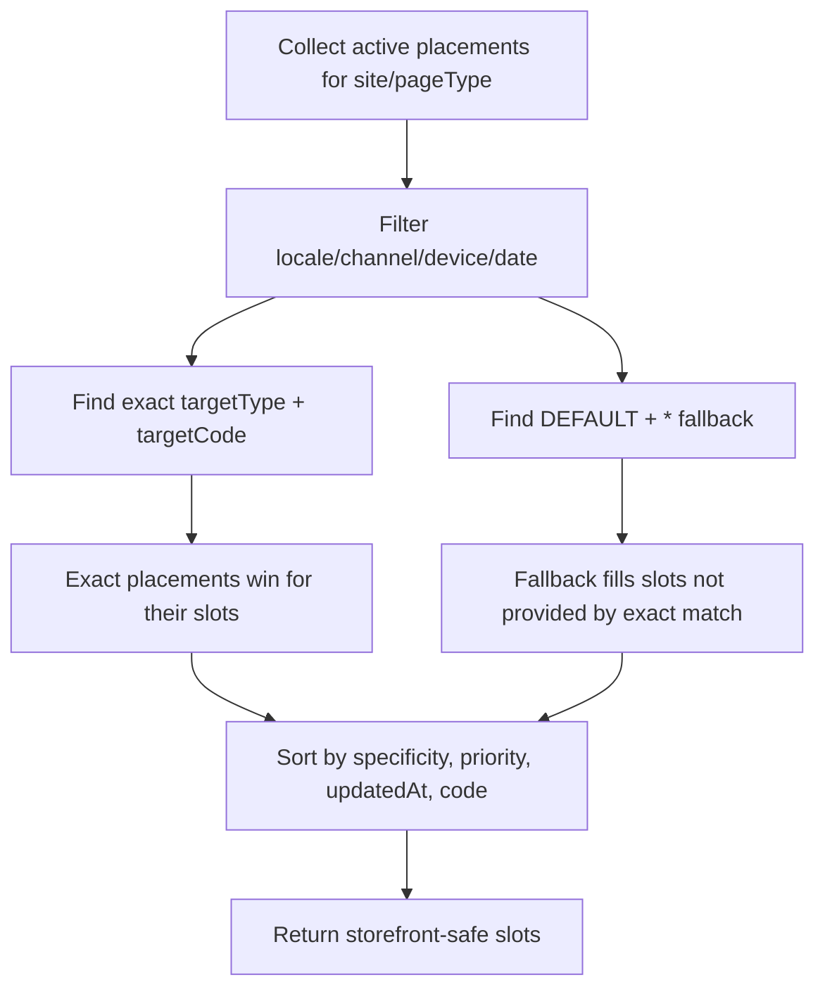

# WCMS Experience Journey Configuration Examples

These examples show how CMS components, placements, Discovery projections, and storefront queries work together.

## 1. Collection journey

User journey:

```text
Home page -> Shop by collection -> New in -> /shop?collection=agoraNewArrivals
```

Business objective:

```text
Show a new-arrivals hero and curated carousel while Commerce/Search returns products tagged with the collection.
```

Placement:

```js
{
  code: 'agoraApparelShopNewArrivalsHeroPlacement',
  site: 'agoraApparelSite',
  pageType: 'PRODUCT_LISTING',
  slot: 'hero',
  targetType: 'COLLECTION',
  targetCode: 'agoraNewArrivals',
  component: 'agoraApparelProductListingExperience',
  rendererKey: 'agora.productListing',
  contractVersion: 1,
  specificity: 100,
  priority: 90,
  locale: 'en-US',
  channel: 'web',
  publicationStatus: 'STAGED',
  deliveryStatus: 'ACTIVE',
  properties: {
    eyebrow: 'New season edit',
    heading: 'Fresh styles just in',
    heroMediaCode: 'agora-owned-collection-new-in'
  }
}
```

Resolver request:

```json
{
  "site": "agoraApparelSite",
  "pageType": "PRODUCT_LISTING",
  "targetType": "COLLECTION",
  "targetCode": "agoraNewArrivals",
  "locale": "en-US",
  "channel": "web"
}
```

Commerce product query:

```text
/search?collection=agoraNewArrivals&page=1&pageSize=10
```

Expected page result:

```text
hero -> New arrivals CMS hero
featuredCarousel -> default or collection-specific carousel
productGrid -> 10 products from Commerce/Search
filters -> backend-driven product facets
pagination -> page size 10
```

## 2. Brand journey

User journey:

```text
Mega menu -> Brands -> Atelier Minimal -> /shop?brand=atelier-minimal
```

Business objective:

```text
Tell a brand story and then show only products for that brand.
```

Placement:

```js
{
  code: 'atelierMinimalBrandHeroPlacement',
  site: 'agoraApparelSite',
  pageType: 'PRODUCT_LISTING',
  slot: 'hero',
  targetType: 'BRAND',
  targetCode: 'atelier-minimal',
  component: 'atelierMinimalBrandHeroContainer',
  rendererKey: 'agora.brandHero',
  contractVersion: 1,
  specificity: 100,
  priority: 95,
  locale: 'en-US',
  channel: 'web',
  publicationStatus: 'STAGED',
  deliveryStatus: 'ACTIVE',
  properties: {
    eyebrow: 'Brand focus',
    heading: 'Atelier Minimal',
    summary: 'Soft tailoring and refined everyday staples.'
  }
}
```

Resolver request:

```json
{
  "site": "agoraApparelSite",
  "pageType": "PRODUCT_LISTING",
  "targetType": "BRAND",
  "targetCode": "atelier-minimal",
  "locale": "en-US",
  "channel": "web"
}
```

Commerce product query:

```text
/search?brand=atelier-minimal&page=1&pageSize=10
```

Expected page result:

```text
hero -> brand-specific CMS hero
topPromo -> brand-specific promo if configured, otherwise default
productGrid -> products filtered by brand
seoContent -> brand SEO block if configured, otherwise none/default
```

## 3. Category journey

User journey:

```text
Main menu -> Clothing -> /shop?category=agoraWomen
```

Placement:

```js
{
  code: 'agoraApparelShopClothingHeroPlacement',
  site: 'agoraApparelSite',
  pageType: 'PRODUCT_LISTING',
  slot: 'hero',
  targetType: 'CATEGORY',
  targetCode: 'agoraWomen',
  component: 'agoraApparelProductListingExperience',
  rendererKey: 'agora.productListing',
  contractVersion: 1,
  priority: 80,
  specificity: 90
}
```

Expected page result:

```text
hero -> Clothing-specific hero
productGrid -> products with category agoraWomen
filters -> categories, colors, sizes, price, sale-only
sort -> configured listing sort options
```

## 4. Default fallback journey

User journey:

```text
/shop?collection=unknown
```

Fallback placement:

```js
{
  code: 'agoraApparelShopDefaultHeroPlacement',
  site: 'agoraApparelSite',
  pageType: 'PRODUCT_LISTING',
  slot: 'hero',
  targetType: 'DEFAULT',
  targetCode: '*',
  component: 'agoraApparelProductListingExperience',
  rendererKey: 'agora.productListing',
  contractVersion: 1,
  priority: 10
}
```

Expected page result:

```text
hero -> default shop hero
productGrid -> products returned by Commerce/Search for the query if valid, otherwise default listing/search behavior
diagnostics.fallbackUsed -> true in controlled preview/support views
```

## 5. Collections index journey

User journey:

```text
Main menu -> Collections -> /collections
```

Placement:

```js
{
  code: 'agoraApparelCollectionsIndexHeroPlacement',
  site: 'agoraApparelSite',
  pageType: 'COLLECTION_INDEX',
  slot: 'hero',
  targetType: 'DEFAULT',
  targetCode: '*',
  component: 'agoraApparelCollectionIndexExperience',
  rendererKey: 'agora.collectionIndex',
  contractVersion: 1
}
```

Expected page result:

```text
hero -> collection-index story
collectionGrid -> available collection/category/brand tiles
tile click -> /shop?collection=... or /shop?category=... or /shop?brand=...
```

## 6. Resolution precedence



## 7. Business validation checklist

For each journey, verify:

- target URL opens the expected hero;
- missing target uses fallback;
- product grid still follows Commerce/Search query;
- only 10 products appear per page when configured;
- filters/sort remain shared and backend-driven;
- mobile, tablet, and desktop layouts work;
- unsupported renderer versions degrade safely.
