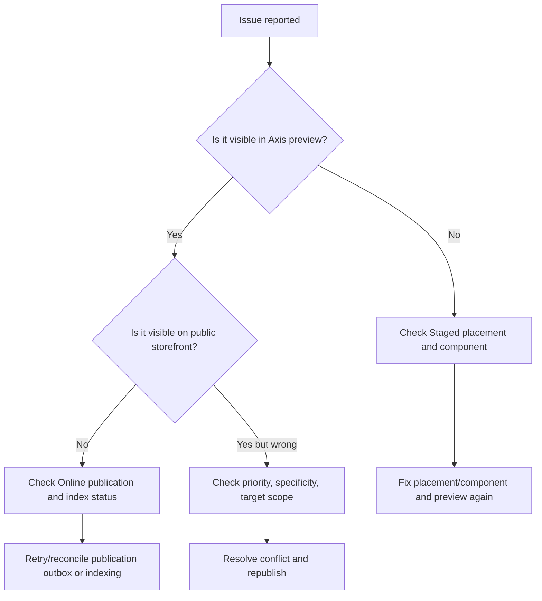

# WCMS Experience Troubleshooting and Index Status Guide

This guide explains how to diagnose targeted CMS experience issues from Axis, backend logs, and contract behavior.

## 1. Common symptoms

| Symptom | Likely cause | First check |
| --- | --- | --- |
| Page shows default hero | Specific placement missing, inactive, not published, or lower priority | Experience Studio Preview |
| Page shows no hero | No exact placement and no default fallback | Placements screen by page type and slot |
| Axis preview works but storefront does not | Staged projection exists, Online projection missing | Index Status screen |
| Wrong component appears | Priority/specificity conflict | Placement conflict view |
| Component appears after campaign ended | Missing or incorrect `validTo` | Placement date window |
| Storefront ignores component | Unsupported renderer key/version | Renderer compatibility panel |
| Publish succeeded but content not visible | Index event pending/failed | CMS outbox and WCMS Experience index status |

## 2. Diagnostic flow



## 3. Index status fields

Recommended status payload:

```json
{
  "site": "agoraApparelSite",
  "ownerType": "WCMS_EXPERIENCE",
  "indexConfigurationCode": "cmsExperiencePlacement",
  "onlineAlias": "cms_experience_agoraApparelSite_online_current",
  "stagedAlias": "cms_experience_agoraApparelSite_staged_current",
  "currentIndexVersion": "manifest-v12",
  "lastIndexedAt": "2026-08-31T10:15:00.000Z",
  "documentCount": 42,
  "status": "CURRENT"
}
```

## 4. Check whether a placement can match

A placement must pass all checks:

```text
active record
site matches
pageType matches
deliveryStatus is ACTIVE
publicationStatus is ONLINE for public delivery
publicationStatus is STAGED for Axis preview
locale matches, if set
channel matches, if set
device matches, if set
validFrom <= now, if set
validTo >= now, if set
targetType/targetCode exact match OR DEFAULT/*
```

## 5. Conflict resolution

When multiple placements match the same slot:

```text
highest specificity wins
then highest priority
then latest updatedAt
then stable code ordering
```

Recommended business practice:

- use high specificity for brand/category/collection campaigns;
- use lower priority for default fallbacks;
- avoid two active placements with same site/page/slot/target and same priority;
- use date windows for temporary campaigns.

## 6. Publication/indexing recovery

If publication succeeds but experience does not update:

1. Open Axis Index Status.
2. Check latest CMS publication event.
3. Check whether `CMS_ONLINE_CHANGED` event is pending, processing, delivered, or failed.
4. If pending/processing and lease expired, run reconciliation.
5. If failed, inspect failure code.
6. Fix missing service/index/configuration issue.
7. Replay/reconcile outbox.
8. Verify alias points to the expected index version.

Important rule:

```text
Do not manually point public storefronts to Staged projections.
```

## 7. Safe rollback

Rollback must:

- restore previous approved CMS publication pointer;
- rebuild or restore matching WCMS Experience projection;
- keep the previous good Online alias if the rollback projection fails;
- create auditable status evidence.

## 8. Performance troubleshooting

If experience resolution becomes slow, check these items first:

- resolver calls must go through Discovery/Elasticsearch, not raw CMS scans;
- requests must include site, page type, target type, target code, locale, channel, device, and date where available;
- result size must stay bounded by `wcmsExperience.resolver.maxComponents`;
- large component/container payloads should be projected into storefront-safe summaries;
- image binaries must not be embedded in experience payloads; use media references or delivery URLs;
- product lists must stay in Commerce/Search and use their own pagination, for example `pageSize=10` on listing pages;
- broad customer-segment or location targeting should be pre-projected into indexed fields where possible.

## 9. Developer checklist for a failed test

- `wcmsExperienceGovernanceContract` failure means a frozen principle was changed.
- `wcmsExperienceProjectionAdapterContract` failure means resolver/index lookup changed.
- `wcmsExperiencePublicationIndexingContract` failure means document shape, idempotency, alias safety, or event handling changed.
- `cmsPublicationOutboxExperienceConsumerContract` failure means after-commit outbox behavior changed.
- `wcmsExperienceRouteSecurityContract` failure means public delivery or Axis preview permissions changed.
